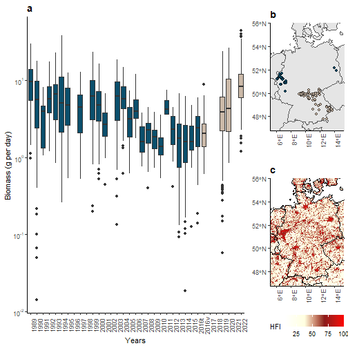

**Weather explains variability in insect biomass, but not its temporal decline**

François Duchenne
Based on the code provided by 
Jörg Müller, Torsten Hothorn, Ye Yuan, Sebastian Seibold, Oliver Mitesser, Julia Rothacher, 
Julia Freund, Clara Wild, Marina Wolz, Annette Menzel (revised and resubmitted, 2023)

This document reproduces tables and figures.

The HTML output file was generated by


```r
# library("knitr")
# spin("analysis.R")
```


Check for packages and if necessary install into library 


```r
rm(list=ls())
pkgs <- c("mgcv", "knitr", "multcomp", "coin", "colorspace", "ggplot2", 
          "data.table", "tidyverse", "vegan","sf","gridExtra","scales",
		  "ggeffects","ggforce","raster","viridis","ggnewscale","ggdensity") 

inst <- pkgs %in% installed.packages()
if (any(inst)) install.packages(pkgs[!inst])
pkg_out <- lapply(pkgs, require, character.only = TRUE)
```

Results were obtained in this environment


```r
date()
```

```
## [1] "Thu Nov  9 09:10:19 2023"
```

```r
sessionInfo()
```

```
## R version 4.3.0 (2023-04-21 ucrt)
## Platform: x86_64-w64-mingw32/x64 (64-bit)
## Running under: Windows 10 x64 (build 19042)
## 
## Matrix products: default
## 
## 
## locale:
## [1] LC_COLLATE=English_Switzerland.utf8  LC_CTYPE=English_Switzerland.utf8   
## [3] LC_MONETARY=English_Switzerland.utf8 LC_NUMERIC=C                        
## [5] LC_TIME=English_Switzerland.utf8    
## 
## time zone: Europe/Paris
## tzcode source: internal
## 
## attached base packages:
## [1] grid      stats     graphics  grDevices utils     datasets  methods  
## [8] base     
## 
## other attached packages:
##  [1] ggdensity_1.0.0   ggnewscale_0.4.9  raster_3.6-20     sp_1.6-1         
##  [5] sf_1.0-13         vegan_2.6-4       lattice_0.21-8    permute_0.9-7    
##  [9] lubridate_1.9.2   forcats_1.0.0     stringr_1.5.0     purrr_1.0.1      
## [13] readr_2.1.4       tidyr_1.3.0       tibble_3.2.1      tidyverse_2.0.0  
## [17] colorspace_2.1-0  coin_1.4-3        multcomp_1.4-24   TH.data_1.1-2    
## [21] MASS_7.3-60       survival_3.5-5    mvtnorm_1.2-2     knitr_1.43       
## [25] mgcv_1.8-42       nlme_3.1-162      car_3.1-2         carData_3.0-5    
## [29] scales_1.2.1      cowplot_1.1.1     viridis_0.6.3     viridisLite_0.4.2
## [33] ggExtra_0.10.0    ggeffects_1.2.3   ggforce_0.4.1     gridExtra_2.3    
## [37] ggplot2_3.4.2     dplyr_1.1.2       data.table_1.14.8
## 
## loaded via a namespace (and not attached):
##  [1] tidyselect_1.2.0   libcoin_1.0-10     farver_2.1.1       fastmap_1.1.1     
##  [5] tweenr_2.0.2       promises_1.2.0.1   digest_0.6.31      timechange_0.2.0  
##  [9] mime_0.12          lifecycle_1.0.3    cluster_2.1.4      ellipsis_0.3.2    
## [13] terra_1.7-29       magrittr_2.0.3     compiler_4.3.0     rlang_1.1.1       
## [17] tools_4.3.0        utf8_1.2.3         labeling_0.4.2     classInt_0.4-9    
## [21] KernSmooth_2.23-21 abind_1.4-5        miniUI_0.1.1.1     withr_2.5.0       
## [25] polyclip_1.10-4    stats4_4.3.0       fansi_1.0.4        xtable_1.8-4      
## [29] e1071_1.7-13       cli_3.6.1          generics_0.1.3     tzdb_0.4.0        
## [33] proxy_0.4-27       DBI_1.1.3          modeltools_0.2-23  splines_4.3.0     
## [37] parallel_4.3.0     matrixStats_1.0.0  vctrs_0.6.3        Matrix_1.5-4.1    
## [41] sandwich_3.0-2     hms_1.1.3          units_0.8-2        glue_1.6.2        
## [45] codetools_0.2-19   stringi_1.7.12     gtable_0.3.3       later_1.3.1       
## [49] munsell_0.5.0      pillar_1.9.0       htmltools_0.5.5    R6_2.5.1          
## [53] evaluate_0.21      shiny_1.7.4        httpuv_1.6.11      class_7.3-22      
## [57] Rcpp_1.0.10        xfun_0.39          zoo_1.8-12         pkgconfig_2.0.3
```

Set working directory


```r
setwd(dir="C:/Users/Duchenne/Documents/Mueller et al Insect Biomass data and R code")
```

Estimation method for mgcv::gam(),
see https://github.com/DistanceDevelopment/dsm/wiki/Why-is-the-default-smoothing-method-%22REML%22-rather-than-%22GCV.Cp%22%3F

Results were compared with both options, results differed marginally


```r
METHOD <- "REML"  ### or "GCV.Cp"
```


Reading all data including published data by Hallmann et al. (2017) PLoS One 12: e0185809 until 2016 (training) 
and new data collected by our own in 2016, 2019, 2020, 2022 (validation)


```r
data_org <-read.csv2("Data_Update_Revision_spells.csv", header = TRUE)
```

Setup factor coding for year (for plots only)


```r
yr <- as.character(data_org$year)
t16 <- which(yr == "2016" & data_org$dataset == "training")
yr[t16] <- "2016t"
v16 <- which(yr == "2016" & data_org$dataset == "validation")
yr[v16] <- "2016v"
lev <- c(1989:2015, "2016t", "2016v", 2017:2022)
data_org$fyear <- factor(yr, levels = lev, labels = lev)


#FIGURE 1 of the answer:
shp=st_read("C:/Users/Duchenne/Downloads/NUTS_RG_20M_2021_3035.shp") #available here: https://ec.europa.eu/eurostat/web/gisco/geodata/reference-data/administrative-units-statistical-units/nuts#nuts21
```

```
## Reading layer `NUTS_RG_20M_2021_3035' from data source 
##   `C:\Users\Duchenne\Downloads\NUTS_RG_20M_2021_3035.shp' using driver `ESRI Shapefile'
## Simple feature collection with 2010 features and 9 fields
## Geometry type: MULTIPOLYGON
## Dimension:     XY
## Bounding box:  xmin: -2823672 ymin: -3076354 xmax: 10026280 ymax: 6404813
## Projected CRS: ETRS89-extended / LAEA Europe
```

```r
shp=subset(shp,LEVL_CODE==0)
shp=st_transform(shp,crs=4326)

margin_map=1

r <- raster("C:/Users/Duchenne/Downloads/hfp-europe-geo-grid/hfp-europe-geo-grid/hfp_Europe_grid/hfp_europe/hdr.adf") #available here: https://sedac.ciesin.columbia.edu/data/set/wildareas-v2-human-footprint-geographic/data-download
```

```
## Please note that rgdal will be retired during October 2023,
## plan transition to sf/stars/terra functions using GDAL and PROJ
## at your earliest convenience.
## See https://r-spatial.org/r/2023/05/15/evolution4.html and https://github.com/r-spatial/evolution
## rgdal: version: 1.6-7, (SVN revision 1203)
## Geospatial Data Abstraction Library extensions to R successfully loaded
## Loaded GDAL runtime: GDAL 3.6.2, released 2023/01/02
## Path to GDAL shared files: C:/Program Files/R/R-4.3.0/library/rgdal/gdal
##  GDAL does not use iconv for recoding strings.
## GDAL binary built with GEOS: TRUE 
## Loaded PROJ runtime: Rel. 9.2.0, March 1st, 2023, [PJ_VERSION: 920]
## Path to PROJ shared files: C:/Program Files/R/R-4.3.0/library/rgdal/proj
## PROJ CDN enabled: FALSE
## Linking to sp version:1.6-1
## To mute warnings of possible GDAL/OSR exportToProj4() degradation,
## use options("rgdal_show_exportToProj4_warnings"="none") before loading sp or rgdal.
```

```r
x <- c(xmin=min(data_org$E)-margin_map-1,xmax=max(data_org$E)+margin_map+1)
y <- c(ymin=min(data_org$N)-margin_map-1,ymax=56+1)
xy <- cbind(x,y)
S <- SpatialPoints(xy)
r <- crop(r, extent(bbox(S)), snap="out")
r2=as.data.frame(rasterToPoints(r))


pl1=ggplot(data=data_org,aes(x=fyear,y=biomass_adj/(todaynr-fromdaynr),fill=dataset))+geom_boxplot()+
theme_bw()+theme(panel.grid=element_blank(),plot.title=element_text(size=14,face="bold",hjust = 0),
legend.position="none",panel.border = element_blank(),axis.line= element_line(),axis.text.x=element_text(angle=90))+
ggtitle("a")+
xlab("Years")+ylab("Biomass (g per day)")+
scale_x_discrete(breaks=c(1989:2015, "2016t", "2016v", 2017:2022),drop=F)+
scale_y_log10(breaks = trans_breaks("log10", function(x) 10^x),labels = trans_format("log10", math_format(10^.x)))+
scale_color_manual(values=c("#0B4F6C","#CBB9A8"))+scale_fill_manual(values=c("#0B4F6C","#CBB9A8"))

pl2=ggplot()+geom_sf(data=shp)+xlim(c(min(data_org$E)-margin_map,max(data_org$E)+margin_map))+ylim(c(min(data_org$N)-margin_map,56))+
geom_point(data=data_org,aes(x=E,y=N,fill=dataset),color="black",shape=21,alpha=0.4)+
theme_bw()+theme(panel.grid=element_blank(),plot.title=element_text(size=14,face="bold",hjust = 0),
legend.position="none",panel.border = element_blank(),axis.line= element_line(),axis.text.x=element_text(angle=90),
axis.title=element_blank())+
ggtitle("b")+
scale_color_manual(values=c("#0B4F6C","#CBB9A8"))+scale_fill_manual(values=c("#0B4F6C","#CBB9A8"))+coord_sf(expand=F)

pl3=ggplot()+geom_raster(data=r2,aes(x=x,y=y,fill=hfp_europe))+
geom_sf(data=shp,fill=NA,col="black",linewidth=0.7)+
xlim(c(min(data_org$E)-margin_map,max(data_org$E)+margin_map))+ylim(c(min(data_org$N)-margin_map,56))+
scale_fill_gradientn(colors=alpha(c("white","lightyellow","firebrick4","red"),1),name="HFI")+
new_scale_fill()+
#geom_point(data=data_org,aes(x=E,y=N,),color="black",shape=21,fill=NA)+
#geom_hdr(data=data_org,aes(x=E,y=N,color=dataset),probs=c(0.95),fill=NA,linewidth=2)+
scale_fill_manual(values=alpha(c("#0B4F6C","#CBB9A8"),0.1),guide=FALSE)+
scale_colour_manual(values=alpha(c("#0B4F6C","#CBB9A8"),1),guide=FALSE)+
theme_bw()+
theme(panel.grid=element_blank(),plot.title=element_text(size=14,face="bold",hjust = 0),
legend.position="bottom",panel.border = element_blank(),axis.line= element_line(),axis.text.x=element_text(angle=90),
axis.title=element_blank())+
ggtitle("c")+coord_sf(expand=F)


grid.arrange(pl1,pl2,pl3,layout_matrix=rbind(c(1,2),c(1,3)),widths=c(2.5,1),heights=c(1,1.2))
```

```
## Warning: Removed 445401 rows containing missing values (`geom_raster()`).
```

```
## Warning: The `guide` argument in `scale_*()` cannot be `FALSE`. This was deprecated in
## ggplot2 3.3.4.
## ℹ Please use "none" instead.
## This warning is displayed once every 8 hours.
## Call `lifecycle::last_lifecycle_warnings()` to see where this warning was
## generated.
```



```r
pdf("Fig1.pdf",width=8,height=5)
grid.arrange(pl1,pl2,pl3,layout_matrix=rbind(c(1,2),c(1,3)),widths=c(2.5,1),heights=c(1,1.3))
```

```
## Warning: Removed 445401 rows containing missing values (`geom_raster()`).
```

```r
dev.off();
```

```
## windows 
##       2
```

Centering the variables precipitation and temperature during sampling on the mean value  
(Temp 16.263, Prec 26.87)

This allows easier interpretation in the presence of interaction terms


```r
data_org$Tmean_c <- data_org$Tmean -16.263
data_org$Psum_c <- data_org$Psum - 26.87
data_org$year_c <- data_org$year - mean(data_org$year)
```

**Splitting in training and validation data**

Data published in Hallmann et al. (2017) PLoS One 12: e0185809


```r
dim(training <- subset(data_org, dataset == "training"))
```

```
## [1] 1503   57
```

```r
training$year <- as.double(training$year)
```

Own data published partly Uhler et al (2021) Nat Commun. 12(1):5946, 
Uhler et al. (2022) Insect Conservation and Diversity 10.1111/icad.12604, 
Busse et al. (2022) Insect Conservation and Diversity 10.1111/icad.12592


```r
dim(validation <- subset(data_org, dataset == "validation"))
```

```
## [1] 761  57
```

**Generalized additive models** a la Uhler et al (2021) Nat Commun. 12(1):5946.

Model 5 substituting year by anomalies

**Model 5:** with weather anomalies instead of year


```r
model5 <- gam(biomass ~ s(meandaynr) + offset(log(todaynr - fromdaynr)) + s(E, N, bs = "tp") +
                               nHerbs + nTrees + Light + ellenTemperature +
                               Arableland + Forest + Grassland + Water + 
                               Tmean_c * Psum_c + 
                               Tmean_anomaly_april_current * Psum_anomaly_april_current + 
                               Tmean_anomaly_april_prev * Psum_anomaly_april_prev + 
                               Tmean_anomaly_winter * Psum_anomaly_winter + 
                               Tmean_anomaly_meandaynr_prev * Psum_anomaly_meandaynr_prev,
                      family = gaussian(link = "log"), 
                      method = METHOD, 
                      data = training)

obj1=summary(model5)
res1=data.frame(Estimate=obj1$p.coeff,se=obj1$se[1:length(obj1$p.coeff)],pval=obj1$p.pv,aic=AIC(model5),resq=obj1$r.sq,varia=names(obj1$p.coeff))
AIC(model5)
```

```
## [1] 13156.26
```

**New Model:** with weather anomalies instead AND year


```r
cor(training[,c("year_c","Tmean_c","Psum_c","Tmean_anomaly_april_current","Psum_anomaly_april_current","Tmean_anomaly_april_prev",
"Psum_anomaly_april_prev","Tmean_anomaly_winter","Psum_anomaly_winter","Tmean_anomaly_meandaynr_prev","Psum_anomaly_meandaynr_prev")])
```

```
##                                   year_c      Tmean_c       Psum_c
## year_c                        1.00000000 -0.103750917  0.351399558
## Tmean_c                      -0.10375092  1.000000000 -0.106365893
## Psum_c                        0.35139956 -0.106365893  1.000000000
## Tmean_anomaly_april_current   0.56482171 -0.099149026  0.273290920
## Psum_anomaly_april_current   -0.50876920  0.081471370 -0.133683555
## Tmean_anomaly_april_prev     -0.06392596  0.036624095  0.006782314
## Psum_anomaly_april_prev      -0.23998646  0.014954538 -0.155360746
## Tmean_anomaly_winter          0.01677266 -0.070118953  0.112770249
## Psum_anomaly_winter          -0.53463842  0.064874943 -0.205582162
## Tmean_anomaly_meandaynr_prev -0.04465542  0.024314173  0.066067939
## Psum_anomaly_meandaynr_prev  -0.01439321  0.009374223 -0.096165962
##                              Tmean_anomaly_april_current
## year_c                                        0.56482171
## Tmean_c                                      -0.09914903
## Psum_c                                        0.27329092
## Tmean_anomaly_april_current                   1.00000000
## Psum_anomaly_april_current                   -0.39451255
## Tmean_anomaly_april_prev                     -0.27487965
## Psum_anomaly_april_prev                      -0.12656514
## Tmean_anomaly_winter                          0.26271011
## Psum_anomaly_winter                          -0.42656666
## Tmean_anomaly_meandaynr_prev                  0.05825072
## Psum_anomaly_meandaynr_prev                  -0.05230229
##                              Psum_anomaly_april_current
## year_c                                      -0.50876920
## Tmean_c                                      0.08147137
## Psum_c                                      -0.13368355
## Tmean_anomaly_april_current                 -0.39451255
## Psum_anomaly_april_current                   1.00000000
## Tmean_anomaly_april_prev                     0.27856665
## Psum_anomaly_april_prev                     -0.29859473
## Tmean_anomaly_winter                         0.22493134
## Psum_anomaly_winter                          0.16932277
## Tmean_anomaly_meandaynr_prev                -0.07186388
## Psum_anomaly_meandaynr_prev                  0.01995749
##                              Tmean_anomaly_april_prev Psum_anomaly_april_prev
## year_c                                   -0.063925961             -0.23998646
## Tmean_c                                   0.036624095              0.01495454
## Psum_c                                    0.006782314             -0.15536075
## Tmean_anomaly_april_current              -0.274879652             -0.12656514
## Psum_anomaly_april_current                0.278566646             -0.29859473
## Tmean_anomaly_april_prev                  1.000000000             -0.09193299
## Psum_anomaly_april_prev                  -0.091932990              1.00000000
## Tmean_anomaly_winter                     -0.261100339             -0.46525152
## Psum_anomaly_winter                       0.278516801              0.37639288
## Tmean_anomaly_meandaynr_prev              0.044921634              0.14673065
## Psum_anomaly_meandaynr_prev               0.141993070              0.19400576
##                              Tmean_anomaly_winter Psum_anomaly_winter
## year_c                                0.016772664         -0.53463842
## Tmean_c                              -0.070118953          0.06487494
## Psum_c                                0.112770249         -0.20558216
## Tmean_anomaly_april_current           0.262710107         -0.42656666
## Psum_anomaly_april_current            0.224931336          0.16932277
## Tmean_anomaly_april_prev             -0.261100339          0.27851680
## Psum_anomaly_april_prev              -0.465251515          0.37639288
## Tmean_anomaly_winter                  1.000000000         -0.16925822
## Psum_anomaly_winter                  -0.169258223          1.00000000
## Tmean_anomaly_meandaynr_prev          0.009031324          0.05699549
## Psum_anomaly_meandaynr_prev          -0.181270718          0.11144628
##                              Tmean_anomaly_meandaynr_prev
## year_c                                       -0.044655415
## Tmean_c                                       0.024314173
## Psum_c                                        0.066067939
## Tmean_anomaly_april_current                   0.058250717
## Psum_anomaly_april_current                   -0.071863876
## Tmean_anomaly_april_prev                      0.044921634
## Psum_anomaly_april_prev                       0.146730646
## Tmean_anomaly_winter                          0.009031324
## Psum_anomaly_winter                           0.056995486
## Tmean_anomaly_meandaynr_prev                  1.000000000
## Psum_anomaly_meandaynr_prev                  -0.282653069
##                              Psum_anomaly_meandaynr_prev
## year_c                                      -0.014393208
## Tmean_c                                      0.009374223
## Psum_c                                      -0.096165962
## Tmean_anomaly_april_current                 -0.052302289
## Psum_anomaly_april_current                   0.019957491
## Tmean_anomaly_april_prev                     0.141993070
## Psum_anomaly_april_prev                      0.194005756
## Tmean_anomaly_winter                        -0.181270718
## Psum_anomaly_winter                          0.111446285
## Tmean_anomaly_meandaynr_prev                -0.282653069
## Psum_anomaly_meandaynr_prev                  1.000000000
```

```r
checkmodel=lm(year_c ~ 	Tmean_c * Psum_c + 
						Tmean_anomaly_april_current * Psum_anomaly_april_current + 
						Tmean_anomaly_april_prev * Psum_anomaly_april_prev + 
						Tmean_anomaly_winter * Psum_anomaly_winter + 
						Tmean_anomaly_meandaynr_prev * Psum_anomaly_meandaynr_prev,data=training)
summary(checkmodel)
```

```
## 
## Call:
## lm(formula = year_c ~ Tmean_c * Psum_c + Tmean_anomaly_april_current * 
##     Psum_anomaly_april_current + Tmean_anomaly_april_prev * Psum_anomaly_april_prev + 
##     Tmean_anomaly_winter * Psum_anomaly_winter + Tmean_anomaly_meandaynr_prev * 
##     Psum_anomaly_meandaynr_prev, data = training)
## 
## Residuals:
##      Min       1Q   Median       3Q      Max 
## -15.1851  -2.7440   0.4745   2.9256  10.6056 
## 
## Coefficients:
##                                                           Estimate Std. Error
## (Intercept)                                              -2.500600   0.171602
## Tmean_c                                                   0.030151   0.037253
## Psum_c                                                    0.030031   0.005650
## Tmean_anomaly_april_current                               1.241767   0.122651
## Psum_anomaly_april_current                               -0.084801   0.008069
## Tmean_anomaly_april_prev                                  2.296553   0.136579
## Psum_anomaly_april_prev                                  -0.078018   0.007762
## Tmean_anomaly_winter                                      1.935078   0.180530
## Psum_anomaly_winter                                      -0.403722   0.015616
## Tmean_anomaly_meandaynr_prev                             -0.250970   0.104885
## Psum_anomaly_meandaynr_prev                               0.026249   0.004599
## Tmean_c:Psum_c                                            0.001349   0.001794
## Tmean_anomaly_april_current:Psum_anomaly_april_current    0.088455   0.004094
## Tmean_anomaly_april_prev:Psum_anomaly_april_prev          0.041656   0.004316
## Tmean_anomaly_winter:Psum_anomaly_winter                  0.231913   0.012516
## Tmean_anomaly_meandaynr_prev:Psum_anomaly_meandaynr_prev  0.016630   0.003254
##                                                          t value Pr(>|t|)    
## (Intercept)                                              -14.572  < 2e-16 ***
## Tmean_c                                                    0.809   0.4184    
## Psum_c                                                     5.315 1.23e-07 ***
## Tmean_anomaly_april_current                               10.124  < 2e-16 ***
## Psum_anomaly_april_current                               -10.510  < 2e-16 ***
## Tmean_anomaly_april_prev                                  16.815  < 2e-16 ***
## Psum_anomaly_april_prev                                  -10.051  < 2e-16 ***
## Tmean_anomaly_winter                                      10.719  < 2e-16 ***
## Psum_anomaly_winter                                      -25.852  < 2e-16 ***
## Tmean_anomaly_meandaynr_prev                              -2.393   0.0168 *  
## Psum_anomaly_meandaynr_prev                                5.708 1.38e-08 ***
## Tmean_c:Psum_c                                             0.752   0.4522    
## Tmean_anomaly_april_current:Psum_anomaly_april_current    21.608  < 2e-16 ***
## Tmean_anomaly_april_prev:Psum_anomaly_april_prev           9.651  < 2e-16 ***
## Tmean_anomaly_winter:Psum_anomaly_winter                  18.529  < 2e-16 ***
## Tmean_anomaly_meandaynr_prev:Psum_anomaly_meandaynr_prev   5.111 3.62e-07 ***
## ---
## Signif. codes:  0 '***' 0.001 '**' 0.01 '*' 0.05 '.' 0.1 ' ' 1
## 
## Residual standard error: 4.771 on 1487 degrees of freedom
## Multiple R-squared:  0.7484,	Adjusted R-squared:  0.7458 
## F-statistic: 294.9 on 15 and 1487 DF,  p-value: < 2.2e-16
```

```r
modelbis <- gam(biomass ~ s(meandaynr) + offset(log(todaynr - fromdaynr)) + s(E, N, bs = "tp") +
                               nHerbs + nTrees + Light + ellenTemperature +
                               Arableland + Forest + Grassland + Water +
							   year_c+
                               Tmean_c * Psum_c + 
                               Tmean_anomaly_april_current * Psum_anomaly_april_current + 
                               Tmean_anomaly_april_prev * Psum_anomaly_april_prev + 
                               Tmean_anomaly_winter * Psum_anomaly_winter + 
                               Tmean_anomaly_meandaynr_prev * Psum_anomaly_meandaynr_prev,
                      family = gaussian(link = "log"), 
                      method = METHOD, 
                      data = training)

obj=summary(modelbis)
res2=data.frame(Estimate=obj$p.coeff,se=obj$se[1:length(obj$p.coeff)],pval=obj$p.pv,aic=AIC(modelbis),resq=obj$r.sq,varia=names(obj$p.coeff))
AIC(modelbis)
```

```
## [1] 13101.68
```

```r
#TABLE 1
resf=merge(res1,res2,by="varia",all=T)
resf$varia=factor(resf$varia,levels=c("(Intercept)","nHerbs","nTrees","Light","ellenTemperature","Arableland","Forest","Grassland","Water",
"Tmean_c","Psum_c","Tmean_c:Psum_c",
"Tmean_anomaly_winter","Psum_anomaly_winter","Tmean_anomaly_winter:Psum_anomaly_winter",
"Tmean_anomaly_april_current","Psum_anomaly_april_current","Tmean_anomaly_april_current:Psum_anomaly_april_current",                   
"Tmean_anomaly_april_prev","Psum_anomaly_april_prev","Tmean_anomaly_april_prev:Psum_anomaly_april_prev",
"Tmean_anomaly_meandaynr_prev","Psum_anomaly_meandaynr_prev","Tmean_anomaly_meandaynr_prev:Psum_anomaly_meandaynr_prev"))
resf=resf[order(resf$varia),]
fwrite(resf,"table_1.csv")


####### FIGURE 2

#PREDICTING the trend using the modified model
newdata=data.frame(meandaynr=mean(training$meandaynr),nHerbs=mean(training$nHerbs),nTrees =mean(training$nTrees ),
Light=mean(training$Light),ellenTemperature=mean(training$ellenTemperature),Arableland=mean(training$Arableland),
Forest=mean(training$Forest),
Grassland =mean(training$Grassland ),Water=mean(training$Water),Tmean_c=mean(training$Tmean_c),Psum_c=mean(training$Psum_c),
Tmean_anomaly_april_current=mean(training$Tmean_anomaly_april_current),
Psum_anomaly_april_current=mean(training$Psum_anomaly_april_current),
Tmean_anomaly_april_prev=mean(training$Tmean_anomaly_april_prev),Psum_anomaly_april_prev =mean(training$Psum_anomaly_april_prev),
Tmean_anomaly_winter=mean(training$Tmean_anomaly_winter),Psum_anomaly_winter =mean(training$Psum_anomaly_winter),
Tmean_anomaly_meandaynr_prev=mean(training$Tmean_anomaly_meandaynr_prev),Psum_anomaly_meandaynr_prev =mean(training$Psum_anomaly_meandaynr_prev),
year_c=1989:2016- mean(data_org$year),todaynr=10,fromdaynr=0,E=mean(training$E),N=mean(training$N))

pre1=as.data.frame(predict(modelbis,type="response",newdata=newdata,se.fit=TRUE))
pre1$dataset2="training"

#compute partial residualsnewdat=training
newdat=training
newdat$year_c=0
training$partial_resid=training$biomass-predict(modelbis,newdata=newdat,type="response")
training$dataset2="training"
#correct the predicts to get partial predicts
pre1$fit=pre1$fit-mean(predict(modelbis,newdata=newdat,type="response"))

#REFITING THE MODEL INCLUDING THE MORE RECENT DATA (VALIDATION DATA) AND PREDICTING
modelbiswithall <- gam(biomass ~ s(meandaynr) + offset(log(todaynr - fromdaynr)) + s(E, N, bs = "tp") +
                               nHerbs + nTrees + Light + ellenTemperature +
                               Arableland + Forest + Grassland + Water +
							   year_c+
                               Tmean_c * Psum_c + 
                               Tmean_anomaly_april_current * Psum_anomaly_april_current + 
                               Tmean_anomaly_april_prev * Psum_anomaly_april_prev + 
                               Tmean_anomaly_winter * Psum_anomaly_winter + 
                               Tmean_anomaly_meandaynr_prev * Psum_anomaly_meandaynr_prev,
                      family = gaussian(link = "log"), 
                      method = METHOD, 
                      data = data_org)

newdata=data.frame(meandaynr=mean(data_org$meandaynr),nHerbs=mean(data_org$nHerbs),nTrees =mean(data_org$nTrees ),
Light=mean(data_org$Light),ellenTemperature=mean(data_org$ellenTemperature),Arableland=mean(data_org$Arableland),
Forest=mean(data_org$Forest),
Grassland =mean(data_org$Grassland ),Water=mean(data_org$Water),Tmean_c=mean(data_org$Tmean_c),Psum_c=mean(data_org$Psum_c),
Tmean_anomaly_april_current=mean(data_org$Tmean_anomaly_april_current),
Psum_anomaly_april_current=mean(data_org$Psum_anomaly_april_current),
Tmean_anomaly_april_prev=mean(data_org$Tmean_anomaly_april_prev),Psum_anomaly_april_prev =mean(data_org$Psum_anomaly_april_prev),
Tmean_anomaly_winter=mean(data_org$Tmean_anomaly_winter),Psum_anomaly_winter =mean(data_org$Psum_anomaly_winter),
Tmean_anomaly_meandaynr_prev=mean(data_org$Tmean_anomaly_meandaynr_prev),Psum_anomaly_meandaynr_prev =mean(data_org$Psum_anomaly_meandaynr_prev),
year_c=1989:2022- mean(data_org$year),todaynr=10,fromdaynr=0,E=mean(data_org$E),N=mean(data_org$N))

pre2=as.data.frame(predict(modelbiswithall,type="response",newdata=newdata,se.fit=TRUE))
pre2$dataset2="training+validation"

#compute partial residualsnewdat=training
newdat=data_org
newdat$year_c=0
data_org$partial_resid=data_org$biomass-predict(modelbiswithall,newdata=newdat,type="response")
data_org$dataset2="training+validation"
#correct the predicts to get partial predicts
pre2$fit=pre2$fit-mean(predict(modelbiswithall,type="response",newdata=newdata))

##### PUT TOGETHER PREDICTIONS
pref=rbind(pre1,pre2)
pref$year=c(1989:2016,1989:2022)

#PLOT PREDICTIONS

one_over_trans = function() trans_new("one_over", function(x) log(x+abs(min(x))))

pl3=ggplot()+
geom_point(data=training,aes(x=year,y=partial_resid/10),color="#0B4F6C",alpha=0.3)+
geom_point(data=data_org,aes(x=year,y=partial_resid/10),color="#CBB9A8",alpha=0.3)+
geom_ribbon(data=pref,aes(x=year,ymin=fit/10-1.96*se.fit/10,ymax=fit/10+1.96*se.fit/10,fill=dataset2),alpha=0.2)+
geom_line(data=pref,aes(x=year,y=fit/10,color=dataset2),size=1.2)+
theme_bw()+theme(panel.grid=element_blank(),plot.title=element_text(size=14,face="bold",hjust = 0),
legend.position="right",panel.border = element_blank(),axis.line= element_line(),axis.text.x=element_text(angle=90))+
ggtitle("a")+
xlab("Years")+ylab("Partial residuals of biomass (g per day)")+
scale_color_manual(values=c("#0B4F6C","#CBB9A8"))+scale_fill_manual(values=c("#0B4F6C","#CBB9A8"))+
facet_zoom(y=TRUE,ylim =c(10,-10),split = TRUE)+labs(color="dataset used\nto fit the model",fill="dataset used\nto fit the model")
```

```
## Warning: Using `size` aesthetic for lines was deprecated in ggplot2 3.4.0.
## ℹ Please use `linewidth` instead.
## This warning is displayed once every 8 hours.
## Call `lifecycle::last_lifecycle_warnings()` to see where this warning was
## generated.
```

```r
pdf("Fig2.pdf",width=9,height=4)
pl3
dev.off();
```

```
## windows 
##       2
```

